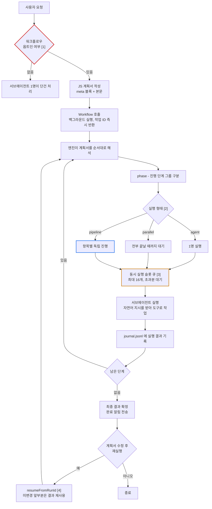

# Claude Code Workflow

## 먼저 알아야 할 개념

| 개념 | 뜻 |
|---|---|
| **에이전트** | 지시를 받아 스스로 판단하며 도구(파일 읽기, 명령 실행 등)를 쓰는 AI |
| **서브에이전트** | 메인 에이전트가 일을 떼어 맡기는 별도 에이전트. 자기만의 대화 공간에서 일하고 결과만 돌려준다 |
| **컨텍스트 윈도우** | AI가 한 번에 기억할 수 있는 대화의 총량. 유한하며, 넘치면 앞부분이 밀려난다 |
| **결정론적** | 같은 입력이면 항상 같은 경로를 밟는 성질. 코드는 결정론적이고, LLM의 판단은 그렇지 않다 |
| **병렬 / 순차** | 여러 일을 동시에 처리하는 것 / 하나씩 차례로 처리하는 것 |

## 이 기능이 없으면 무엇이 불편한가

AI에게 규모 있는 일을 맡길 때 부딪히는 네 가지다.

1. **한 줄로 늘어선다** — 200개 문서 검토를 맡기면 서로 무관해도 하나씩 차례로 처리한다. 총 소요는 각 작업의 합이 된다.
2. **대화가 중간 결과로 찬다** — 200개 결과가 전부 대화에 쌓여, 원래 맥락이 컨텍스트 윈도우 밖으로 밀려난다.
3. **매번 결과가 다르다** — "충분히 찾을 때까지 반복해줘"의 '충분히'를 AI가 그때그때 판단한다. 감사·검증처럼 재현성이 필요한 일에는 쓸 수 없다.
4. **한 곳을 고치면 전부 다시 돈다** — 마지막에 지시를 한 문장 고치면 이미 끝난 199개도 재실행된다.

원인은 하나다 — **일을 어떻게 나누고 언제 멈출지를 AI가 대화하며 즉흥적으로 정하기 때문이다.**

## 이 기능은 무엇인가

**여러 서브에이전트를 지휘하는 계획서를 코드로 미리 써서 통째로 넘기는 기능이다.**

말로 부탁하는 대신, 누구를 몇 명 어떤 순서로 투입할지를 짧은 JavaScript로 적는다. 코드가 지휘하고, 실무는 코드가 불러낸 서브에이전트들이 한다.

| 불편함 | 해소 |
|---|---|
| 순차 실행 | 최대 16명 동시 실행 |
| 대화 오염 | 백그라운드 실행, 최종 결과만 반환 |
| 매번 다른 결과 | 반복·중단 판단을 AI가 아닌 **코드**가 내린다 |
| 전면 재실행 | 안 바뀐 앞부분은 이전 결과를 재사용 |

**코드는 지휘만 하고 실무는 하지 않는다.** 코드가 건네는 것은 프로그램이 아니라 "이 파일을 읽고 문제를 찾아줘" 같은 자연어 문장이다. 그래서 코드에는 파일 접근 권한조차 없다. 즉 이 기능은 AI의 판단력을 코드로 대체하는 게 아니라, **판단이 필요한 곳(실무)과 규칙이면 충분한 곳(지휘)을 분리하는 것**이다.

## 전체 흐름

- 🔴 빨강: 통과하지 못하면 워크플로우 자체를 쓸 수 없는 관문
- 🟠 주황: 실제 처리 속도의 상한
- 🔵 파랑: 다단계 작업의 기본 선택지

---

## [1] 옵트인 판정 기준

수십 명이 한 번에 돌아 비용이 크므로 기본은 꺼져 있다. 아래 중 **하나만 해당해도** 열린다.

| 유형 | 예시 | 지속 |
|---|---|---|
| 키워드 | `ultracode` | 세션 내내 |
| 사용자 발화 | "워크플로우 써줘" | 그 요청 1회 |
| 스킬/슬래시 명령 | 스킬이 Workflow 호출을 지시 | 그 실행 1회 |
| 저장된 워크플로우 지목 | "저번 그 워크플로우 돌려줘" | 그 실행 1회 |

AI 스스로 "병렬이 낫겠는데"라고 판단하는 것만으로는 열리지 않는다.

## [2] 실행 형태 선택 기준

**배리어**란 앞 단계가 전부 끝나야 다음 단계가 시작되는 지점이다. 가장 느린 항목 하나가 나머지를 붙잡아 둔다.

| 형태 | 배리어 | 언제 |
|---|---|---|
| `agent()` | — | 1명이면 충분할 때 |
| `parallel()` | 있음 | 다음 단계가 **전체 결과**를 봐야 할 때 (중복 제거 등) |
| `pipeline()` | 없음 | 기본값. 항목끼리 독립적일 때 |

"결과를 모아 정리해야 해서"는 배리어의 근거가 못 된다 — 그 가공은 파이프라인 단계 안에서 하면 된다.

## [3] 동시 실행 제한

| 항목 | 값 |
|---|---|
| 동시 실행 슬롯 | `min(16, CPU-2)` |
| 1회 호출 항목 수 | 최대 4096개 (초과 시 명시적 오류) |
| 라이프타임 총 에이전트 | 1000개 (무한 루프 방지) |
| 세션 규모 가이드라인 | medium = 15개 미만 (`/config`) |

앞의 셋은 시스템 한계, 마지막은 사용자가 조정 가능한 설정이다. 옵트인(권한)과는 별개 축이다.

## [4] 재실행 시 결과 재사용

계획서를 고쳐 다시 돌리면 **지시문과 옵션이 안 바뀐 앞부분**은 이전 결과를 즉시 반환하고, 첫 변경 지점부터 새로 실행된다.

이를 위해 계획서는 매번 같은 값을 만들어야 하므로 `Date.now()`·`Math.random()`은 호출 시 예외가 난다. 시각이 필요하면 실행 인자로 넘긴다.
